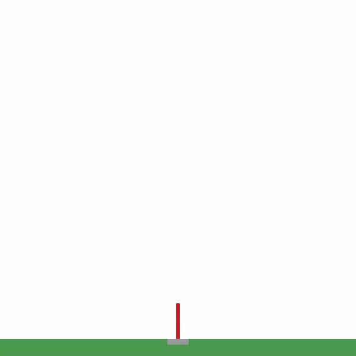

# gym-goddard

An OpenAI gym environment for simulating Goddard's Rocket Problem.

## Goddard's Rocket Problem

First formulated by R. H. Goddard around 1910, this is a classical problem within dynamic optimization and optimal control. The task is simply to find the optimal thrust profile for a vertically ascending rocket in order for it to reach the maximum possible altitude, given that its mass decreas as the fuel is spent and that it is subject to varying drag and gravity.

The state, and the gym's observation space, of the rocket is its vertical position, velocity and mass.

The rocket engine is assumed to be throttled such that the thrust can be continuously controlled between 0 to some maximum limit.



## Installation

```bash
cd gym-goddard
pip install -e .
```

## Enjoy

```python
import gym

env = gym.make('gym_goddard:Goddard-v0')

obs = env.reset()
while True:
    obs, reward, done, info = env.step(action=env.action_space.high)
    env.render('human')
````
